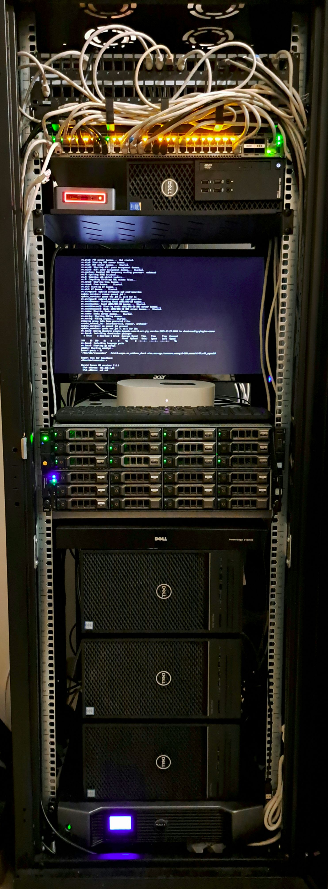

# **Sébastien Séveno**

**Infrastructure Engineer**  
Virtualization • Storage • Automation • Open Source

Vernon, France • Remote • Willing to travel

+33 6 02 25 13 67 - [sebastien@sevenos.fr](mailto:sebastien@sevenos.fr) - [www.sevenos.fr](https://www.sevenos.fr)  
LinkedIn : [Sébastien Séveno](https://www.linkedin.com/in/seveno-sebastien/)  

## PROFILE

Infrastructure engineer focused on designing, operating and continuously improving modern infrastructures, from hardware to applications.

My background combines backend software development with infrastructure engineering, providing a broad understanding of how software interacts with the platforms it runs on. This systems-oriented approach helps anticipate the impact of architectural decisions across the entire stack.

Most of my technical skills have been acquired through years of self-directed learning and experimentation on a production-like homelab, allowing me to quickly adapt to new technologies, environments and operational constraints.

After several years in backend development, I deliberately chose to move closer to infrastructure engineering, which has become my primary professional focus.

I particularly enjoy designing reliable platforms, automating repetitive work and continuously improving existing systems while keeping long-term maintainability in mind.

## SELF-HOSTED INFRASTRUCTURE (HOMELAB)
<table border="0">
<tr>
<td width="20%">

</td>
<td>

For more than 10 years, I have been designing, operating and continuously improving a production-like infrastructure used to experiment with enterprise technologies, validate architectures and automate deployments.

<ul>
<li> Two Proxmox clusters (3 nodes each) for Production and Pre-production (HA, Live Migration) </li>
<li> 96 TB storage infrastructure with distributed Ceph storage </li>
<li> 10 GbE segmented network (VLANs) with OPNsense firewall and Arista switching </li>
<li> Site-to-site WireGuard VPN with secure remote access </li>
<li> Load balancing using HAProxy </li>
<li> Automated TLS certificate management using local & public ACME (DNS-01) </li>
<li> Monitoring and alerting with Prometheus, Grafana and Uptime Kuma </li>
<li> DNS infrastructure using Bind9 and Unbound </li>
<li> DHCP infrastructure using Kea with Dynamic DNS integration </li>
<li> PXE provisioning for automated deployment of cluster nodes </li>
<li> Infrastructure deployment and configuration automated with Ansible </li>
<li> Local and off-site backups over encrypted VPN links </li>
<li> Architecture documentation and continuous improvements </li>
</ul>
**Focus:** high availability, automation, observability, security and long-term maintainability.
</td>
</tr>
</table>

## TECHNICAL SKILLS

### Infrastructure Engineering

- Infrastructure architecture and design
- High Availability (HA)
- Resilience & SPOF mitigation
- Disaster Recovery (DR)
- Capacity planning
- Infrastructure evolution and modernization
- Long-term maintainability
- Hardware sizing and component selection
- Power efficiency & resource optimization

### Infrastructure Platforms

- Linux (Debian)
- Windows Server & Workstations
- Proxmox VE (Clusters, HA, Cloud-Init)
- Docker / Docker Compose
- Reverse Proxy (HAProxy, Caddy, Nginx)

### Storage & Data Protection

- Distributed storage (Ceph)
- High-capacity storage architectures
- Proxmox Backup Server
- Backup strategies
- Off-site backup
- Disaster Recovery planning

### Networking & Connectivity

- VLAN segmentation
- Routing & Firewalling (OPNsense, OpenWRT)
- WireGuard & IPsec VPN
- High-speed networking (10 GbE)
- DHCP (Kea)
- DNS (Bind9, Unbound)
  - Authoritative & Recursive DNS
  - Split-horizon DNS
  - Dynamic DNS (Kea)
  - ACME DNS-01
- TLS / ACME
- Good understanding of cryptographic principles

### Identity & Security

- Authentik
- Keycloak
- LDAP
- Single Sign-On (SSO)
- OAuth2
- OpenID Connect
- Security best practices
- Basic penetration testing experience

### Observability & Operations

- Prometheus
- Grafana
- Uptime Kuma
- NetBox
- Infrastructure documentation
- Infrastructure as Code
- Incident investigation & troubleshooting
- Root cause analysis
- Operational monitoring & alerting

### Automation

- Python scripting
- Ansible
- Terraform
- Cloud-Init
- PXE provisioning
- Git / GitHub
- CI fundamentals

### Hardware

- Enterprise server platforms
- Storage hardware
- Power distribution
- Hardware troubleshooting
- Component selection

## PROFESSIONAL EXPERIENCE

### IT Support Engineer (Level 2/3) — SPIE

September 2025 – Present

Production environment – 300 users

- Maintaining critical production systems
- Took ownership of the position after only two weeks of handover
- Reduced incident backlog while improving user satisfaction
- Level 2 and Level 3 troubleshooting (workstations, servers and networking)
- Physical interventions on servers, switches, Wi-Fi infrastructure and cabling
- Coordination with remote engineering teams

### IT Support Engineer — ArianeGroup

June 2018 – June 2019

- End-user and infrastructure support for a sensitive environment (1,500 users)
- SCCM deployment and administration
- CMDB management
- Mobile Device Management (MDM)

### Backend Software Engineer

June 2019 – March 2023

- Backend API development
- Keycloak integration
- Microservice architecture
- Performance-oriented backend design

## EDUCATION

BTS SIO — Network & Systems Administration

## LANGUAGES

French: Native

English: Professional (C1)

## ADDITIONAL INFORMATION

Driving licence (B)

Remote-ready office

Enjoys datacenter interventions and hands-on infrastructure work.
